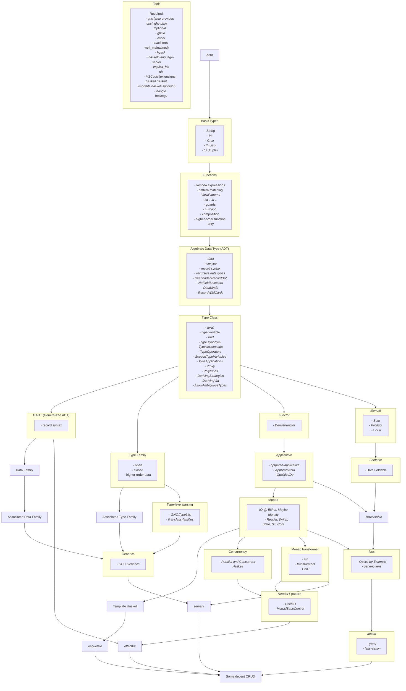

# Haskell roadmap

Connections between topics in Haskell.

An arrow from a node `A` to a node `B` means `A` is a prerequisite of `B`.

Novices start at `Zero`.

```mermaid
%% Links can be added via <a href="https://mermaid.live"></a>

graph TB
    zero["`Zero`"]
    subgraph tools["`Tools`"]
        _tools[
        Required:
        - <i>ghc</i> &lpar;also provides <i>ghci</i>, <i>ghc-pkg</i>&rpar;
        Optional:
        - <i>ghcid</i>
        - <i>cabal</i>
        - <i>stack</i> &lpar;not well_maintained&rpar;
        - <i>hpack</i>
        - <i>haskell-language-server</i>
        - <i>implicit_hie</i>
        - <i>nix</i>
        - <i>VSCode</i> &lpar;extensions <i>haskell.haskell</i>,<br><i>visortelle.haskell-spotlight</i>&rpar;
        - <i>hoogle</i>
        - <i>hackage</i>
        ]
        
        style _tools text_align:left
    end
    
    subgraph basic_types["`Basic Types`"]
        _basic_types[
        - <i>String</i>
        - <i>Int</i>
        - <i>Char</i>
        - <i>&lbrack;&rbrack;</i> &lpar;List&rpar;
        - <i>&lpar;,&rpar;</i> &lpar;Tuple&rpar;
        ]
        style _basic_types text_align:left
    end

    subgraph function["`Functions`"]
        _function[
        - lambda expressions
        - pattern matching
        - <i>ViewPatterns</i>
        - <i>let .. in ..</i>
        - guards
        - currying
        - composition
        - higher-order function
        - arity
        ]
        style _function text_align:left
    end
    
    subgraph algebraic_data_type["`Algebraic Data Type (ADT)`"]
      _algebraic_data_type[
        - <i>data</i>
        - <i>newtype</i>
        - record syntax
        - <i>recursive data types</i>
        - <i>OverloadedRecordDot</i>
        - <i>NoFieldSelectors</i>
        - <i>DataKinds</i>
        - <i>RecordWildCards</i>
      ]
      style _algebraic_data_type text_align:left
    end
    
    subgraph functor[<i>Functor</i>]
        _functor[
        - <i>DeriveFunctor</i>
        ]
        style _functor text_align:left
    end
    
    subgraph applicative[<i>Applicative</i>]
        _applicative[
        - <i>optparse-applicative</i>
        - <i>ApplicativeDo</i>
        - <i>QualifiedDo</i>
        ]
        style _applicative text_align:left
    end
    
    subgraph monad["`Monad`"]
        _monad[
        - <i>IO, &lbrack;&rbrack;, Either, Maybe, Identity</i>
        - <i>Reader, Writer, State, ST, Cont</i>
        ]
        style _monad text_align:left
    end
    
    subgraph generalized_algebraic_data_type["`GADT &lpar;Generalized ADT&rpar; `"]
        _generalized_algebraic_data_type[
        - record syntax
        ]
        style _generalized_algebraic_data_type text_align:left
    end

    subgraph type_family["`Type Family`"]
        _type_family[
        - open
        - closed
        - higher-order data
        ]
        style _type_family text_align:left
    end

    data_family["`Data Family`"]
    
    associated_type_family["`Associated Type Family`"]
    associated_data_family["`Associated Data Family`"]
    
    subgraph type_class["`Type Class`"]
        _type_class[
        - <i>forall</i>
        - type variable
        - <i>kind</i>
        - type synonym
        - <i>Typeclassopedia</i>
        - <i>TypeOperators</i>
        - <i>ScopedTypeVariables</i>
        - <i>TypeApplications</i>
        - <i>Proxy</i>
        - <i>PolyKinds<i>
        - <i>DerivingStrategies</i>
        - <i>DerivingVia</i>
        - <i>AllowAmbiguousTypes</i>
        ]
    end
    
    template_haskell["`Template Haskell`"]

    subgraph lens[<i>lens</i>]
        _lens[
        - <i>Optics by Example</i>
        - <i>generic-lens</i>
        ]
        style _lens text_align:left
    end
    
    subgraph readert[<i>ReaderT</i> pattern]
        _readert[
        - <i>UnliftIO</i>
        - <i>MonadBaseControl</i>
        ]
        style _readert text_align:left
    end
    
    subgraph generics["`Generics`"]
        _generics[
        - <i>GHC.Generics</i>
        ]
    end
    
    subgraph monad_transformer["`Monad transformer`"]
        _monad_transformer[
        - <i>mtl</i>
        - <i>transformers</i>
        - <i>ConT</i>
        ]
        style _monad_transformer text_align:left
    end
    
    subgraph type_level_parsing["`Type-level parsing`"]
        _type_level_parsing[
        - <i>GHC.TypeLits</i>
        - <i>first-class-families</i>
        ]
        style _type_level_parsing text_align:left
    end

    subgraph concurrency["`Concurrency`"]
        _concurrency[
        - <i>Parallel and Concurrent Haskell<i>
        %% - <i>exceptions</i>
        ]
    end

    subgraph aeson[<i>aeson</i>]
        _aeson[
            - <i>yaml</i>
            - <i>lens-aeson</i>
        ]
    end
    
    subgraph foldable[<i>Foldable</i>]
        _foldable[
            - Data.Foldable
        ]
    end
    %% testing
    %% books
    %% cps
    %% contramap
    %% profunctor
    %% tagged instances
    subgraph monoid[<i>Monoid</i>]
        _monoid[
            - <i>Sum</i>
            - <i>Product</i>
            - <i>a -> a</i>
        ]
    end
    traversable[<i>Traversable</i>]
    effectful[<i>effectful</i>]
    servant[<i>servant</i>]
    esqueleto[<i>esqueleto</i>]
    crud[Some decent CRUD]


    zero --> basic_types
    
    basic_types --> function
    
    function --> algebraic_data_type
    
    type_class --> generalized_algebraic_data_type
    type_class --> type_family
    type_class --> functor
    type_class --> monoid

    algebraic_data_type --> type_class

    functor --> applicative
    
    applicative --> monad
    applicative --> traversable

    generalized_algebraic_data_type --> data_family

    type_family --> associated_type_family
    type_family --> type_level_parsing

    data_family --> associated_data_family

    monad --> template_haskell
    monad --> concurrency
    monad --> monad_transformer
    monad --> lens

    associated_type_family --> generics
    associated_data_family --> generics
    
    concurrency --> readert
    monad_transformer --> readert

    generalized_algebraic_data_type --> effectful
    readert --> effectful
    
    monoid --> foldable
    foldable --> traversable
    traversable --> lens

    lens --> aeson

    monad_transformer --> servant
    generics --> servant

    template_haskell --> esqueleto
    esqueleto --> crud
    servant --> crud
    effectful --> crud
    aeson --> crud

    type_level_parsing --> generics
```
